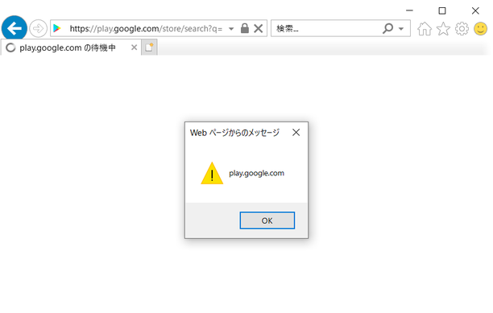

# Googleの脆弱性を見つけて$5000を貰うまでの話

## はじめに
Googleには未発見の脆弱性を報告すると、種類に応じて報奨金が貰える制度「Google Vulnerability Reward Program (VRP)」がある。世のBug bounty hunterたちは、英語を始め様々な"言語"を駆使しているため問題なく報告できるが、偶然にも脆弱性を発見してしまった三流エンジニアは日本語記事が少なく苦労する。そんな人のため、少しの自慢を混ぜた記録を置いておく。  
[Google Vulnerability Reward Program (VRP) Rules](https://www.google.com/about/appsecurity/reward-program/)  

## 脆弱性を見つける
2019年10月、以下のGoogleブックスにXSS(クロスサイトスクリプティング)が存在したとの記事を読んだ。  
[やはりネットサーフィンをしていたらたまたまGoogleのサイトにXSSの脆弱性を見つけたのはまちがっている](http://nootropic.me/blog/blog/2016/09/20/%e3%82%84%e3%81%af%e3%82%8a%e3%83%8d%e3%83%83%e3%83%88%e3%82%b5%e3%83%bc%e3%83%95%e3%82%a3%e3%83%b3%e3%82%92%e3%81%97%e3%81%a6%e3%81%84%e3%81%9f%e3%82%89%e3%81%9f%e3%81%be%e3%81%9f%e3%81%begoogle/)  
XSS自体、よく知っている脆弱性だったため、自分でも何か見つけることが出来ないかとGoogleにチェックデータを入力し、ソースコードを眺めていた。すると反射型XSSを発動可能と思しき部分を発見することができた。  
対象は以下になる。  
`www.google.com`  
`news.google.com`  
`play.google.com`  
`contacts.google.com`  
`assistant.google.com`  
詳細についてここでは明かさない。  

## Googleに報告する
Googleに報告するにあたり、XSSの可能性だけでは心もとないためPoC(概念実証)を作成した。無事alertを実行可能な一行のコードが完成したので[Report a security vulnerability](https://goo.gl/vulnz)よりGoogleに報告した。受け取るレポートの90%以上が脆弱性では無いらしいので、報告する場合はしっかりとルールを確認した方が良いと思われる。レポートにはPoC、被害予想、対象、名前のみを記載した。  

## 脆弱性は無い by Google
報告後数分で自動返信メールが到着し、その後数件「** NOTE: This e-mail has been generated automatically. **」で始まる自動送信メールが続いた。これらのメールでは、Triageやstatus、priority、severityの変更が行われていた。一週間後、自動ではないメールを受信し、そこには以下のように書かれていた。  

>Changed  
>status:  Assigned  →  Not Reproducible  
>
>Hey,  
>Thanks for the report.  
>We cannot reproduce the issue you're reporting.  
>Can you send us screenshot and specify in which browser it works for you?  

**再現性がない ;(**  
受け取るレポートのPoCを全て解析するのは時間的にも難しい。先のレポートが不出来だったことに薄々感づいていたため、再度詳細を報告することにした。  

## Googleに詳細を追加報告する
返信を受けて、発見したXSSの仕組み、スクリーンショット、検証に使用したブラウザバージョンなど詳細を再度報告した。  
送信したスクリーンショット(play.google.com)  
  
すると翌日以下のようなメールを受信した。  

>Changed  
>status:  Not Reproducible  →  Accepted  

さらに翌日にstatusはAssignedとなり、数回PoCの解説を行った。  

## 脆弱性は無いことも無い by Google
ついに以下のような記念すべき返信が届いた。  

>Changed  
>type:  Customer Issue  →  Bug  
>status:  Assigned  →  Accepted  
>
>Hi,  
>Nice catch!  
>I've filed a bug based on your report.  
>The panel will evaluate it at the next VRP panel meeting and we'll update you once we've got more information.  
>All you need to do now is wait.  
>If you don't hear back from us in 2-3 weeks or have additional information about the vulnerability, let us know!  

typeがBugになっているではないか。VRP panel meetingが終了するまで、行えることはないようだ。この頃からメールの受信が楽しみになってきていた。
VRP panel meetingのスケジュールは[Weekly Panel Meeting](https://sites.google.com/site/bughunteruniversity/behind-the-scenes/rewards-philosophy/weekly-panel-meeting)で確認できる。  

## $5000.00あげちゃう by Google
VRP panel meetingの翌日、さらに嬉しいメールが届いた。  

>** NOTE: This is an automatically generated email **  
>
>Hello,  
>Thank you for reporting this bug.  
>As part of Google's Vulnerability Reward Program, the panel has decided to issue a reward of $5000.00.  
>
>Important: if you aren't registered with Google as a supplier, p2p-vrp@google.com will reach out to you.  
>If you have registered in the past, no need to do it again - sit back and relax, and we will process the payment soon.  
>
>If you have any payment related requests, please direct them to p2p-vrp@google.com.  
>Please remember to include the subject of this email and the email address that the report was sent from.  

なんと$5000.00も貰えるらしい(5倍にして)。これは[はじめに](#はじめに)に記載したルールに記述してあり、「Other highly sensitive applications」の「Execute code on the client」であるらしい。もちろんサプライヤーとして登録した覚えなど無いので、待機するのみである。その間に、[Bughunter Hall of Fame](https://bughunter.withgoogle.com/rank/hof)へプロフィールを作成した。驚くべき事にランキングが165/750ほどであった。  

## 支払い情報を登録する
一週間後、`p2p-vrp@google.com`から支払い情報の登録を促すメールを受信した。手順通り支払い情報を登録すれば良いので、何も問題は起こらない。登録後に送信されてくるメールを転送する必要があることと、「Certification of no US activities」の提出が必要であることに注意したい。TitleにはPresidentと記入した。  

## 報奨金を獲得する
支払い情報を登録してから約一ヶ月後、報奨金が入金されたことを確認した。年末年始を挟んだためか支払いに時間がかかったようだ。明細に「ＧＯＯＧＬＥ」と表示されているのは少し嬉しい。  

## タイムライン
| 日付 | 状態 |
| :-- | :-- |
| 2019/10/30 | 脆弱性発見 |
| 2019/10/30 | 脆弱性報告 |
| 2019/11/06 | status:Not Reproducible |
| 2019/11/07 | 脆弱性追加報告 |
| 2019/11/23 | type:Bug |
| 2019/11/28 | $5000.00 |
| 2019/12/05 | 支払い情報登録 |
| 2020/01/10 | 報奨金獲得 |
