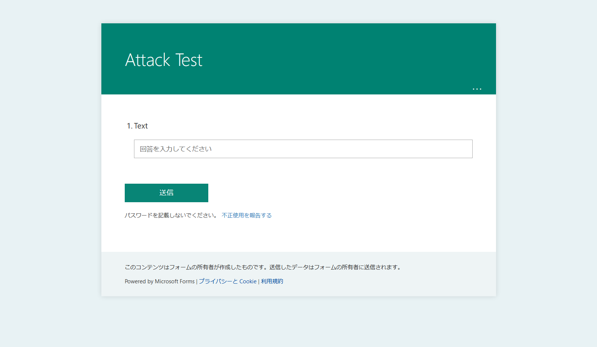
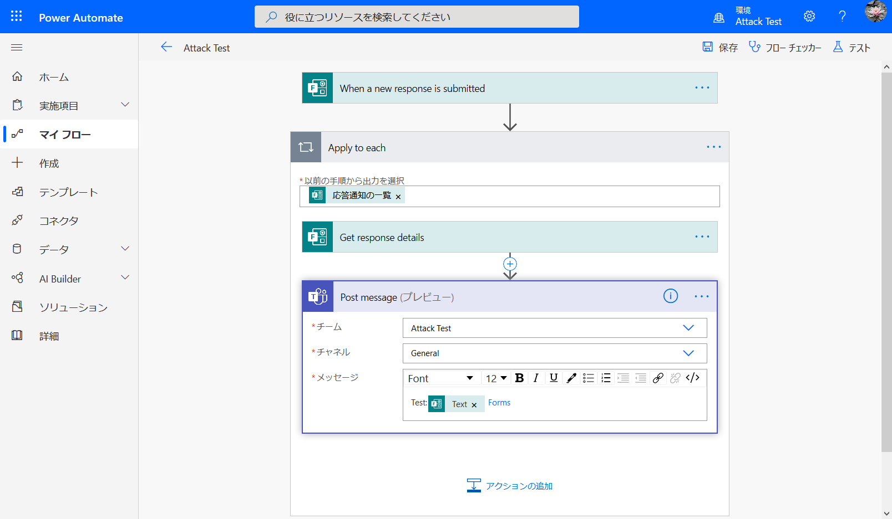

# Microsoftに認定されなかった脆弱性？の話

## はじめに
Microsoftには製品やサービスの脆弱性を発見すると、報奨金を貰うことができる制度「Microsoft Bug Bounty Program」がある。本記事ではMicrosoftに認定されなかったものの、ユーザへのリスクとなり得る報告を置いておく。内容はMicrosoftが直ちに修正するに当たらないと判断したものであるため、ユーザ側での対策が必要となる。  
[Microsoft Bug Bounty Program](https://www.microsoft.com/en-us/msrc/bounty)  

**本記事はMicrosoftより公開許可を受けています。本記事の内容を験する場合、法律により処罰される可能性があります。**  

## 脆弱性概要
本脆弱性はMicrosoft Formsへの投稿をMicrosoft Power Automateを用いて、Microsoft Teamsへ通知(転送)する場合に発生する。被害としては通知テンプレートの改竄、不正なリンクの埋め込み、DDoS攻撃への荷担などである。  
### 設定情報
Microsoft Formsで次のようなフォームを作成する。  
  
Microsoft Power Automateの通知テンプレートを次のように設定する。文字列"Forms"のリンク先にはhttps://forms.office.com を指定した。  
  
### 正しい振る舞い
正しい振る舞いを確認するため、FormsのTextに文を入れて送信を行う。  
  
リンクも正常に機能しているようだ。  
### 通知テンプレートの改竄
次に、以下をFormsから送信することでテンプレートの内容を改竄する。具体的にはリンク部分を消し去り、任意の文字列を挿入できる。  
```html
ある日の事でございます。 Teams<iframe
```
リンク部分の"Forms"の文字列が消え、"Teams"のリンクなし文字列に置き換わっている。  
  
### 不正なリンクの埋め込み
さらにリンク部分の"Forms"の文字列に、不正なリンクを挿入する。以下をFormsから送信する。  
```html
ある日の事でございます。 <a href=http://example.com
```
https://forms.office.com だったはずのリンクが、http://example.com に変更されていることがわかる。  
  
悪意のある第三者がhttp://example.com のような優しいリンクを挿入することはない。  
### DDoS攻撃への荷担
imgタグを挿入することによって、DDoS攻撃へユーザを荷担させることもできる。imgタグを以下のpythonで生成する。
```python
for i in range(50):
    print("".format(i),end="")
```
xxx.xxx.xxx.xxxには被害者のIPが入ることとなる。今回は試験的にRequestBinのhttps://enja21a308d3e.x.pipedream.net を用いた。  
Teamsへの通知は以下となる。  
  
RequestBinには次のようなアクセスログがMicrosoftサーバより発せられていた。  
  
これを複数のFormsへ送信し続けることで、他者にMicrosoftサーバ経由でのDDoS攻撃を行わせることができる。Teamsはimgタグを蓄積するため一度に多量のアクセスが可能となる。  
### ユーザが行うべき対策
Microsoft Power Automateより受け取ったコンテンツを信用しない。現状、imgタグへの対策はユーザ側では難しい。  

## Microsoftの評価
> Hi,  
> Thank you for your submission. We determined your finding does not meet our bar for immediate servicing.  
> It is a Low/Moderate bug, which would require significant effort to exploit. You may disclose at this time if you wish.  

リンク改竄できてるのにw  
🕷  