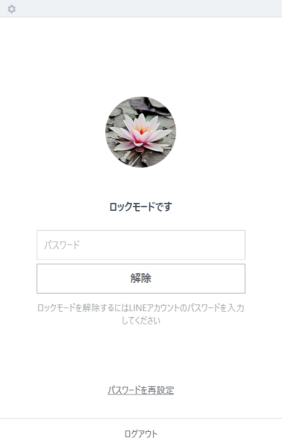
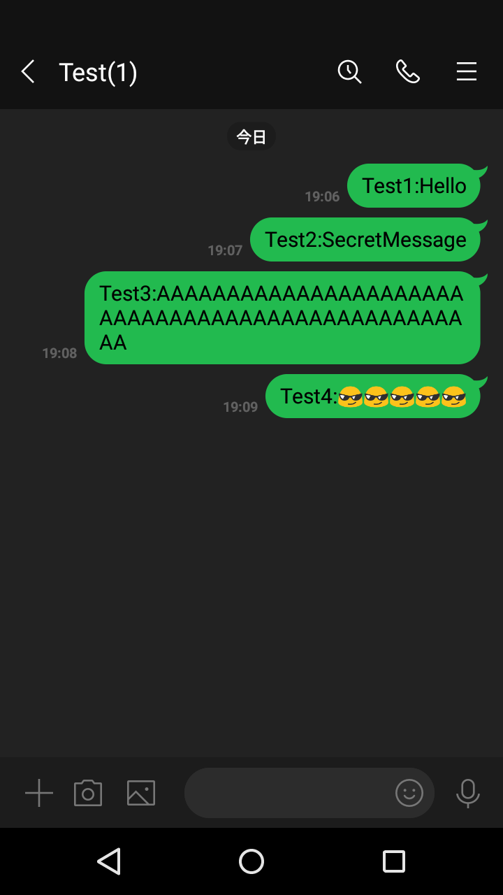
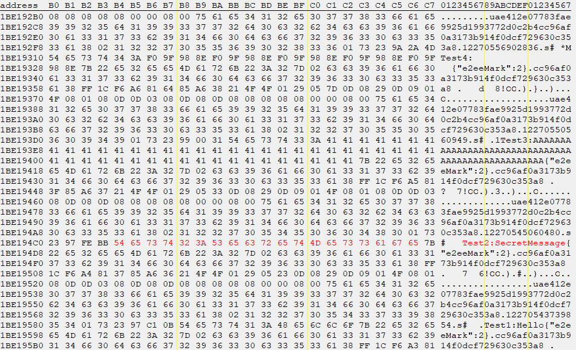
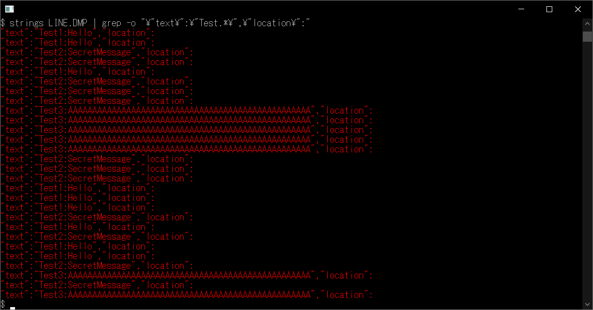

# PC版LINEのロックモード越しにメッセージを読み取る話

## はじめに
PC版LINEには一時的に席を立つ場合や長時間操作されなかった場合にメッセージの送信や閲覧をロックできるロックモードがある。以下のような画面を見たことがあるだろう。  
  
実はこのロックモード、第三者が物理的に端末にアクセスできる場合にはメッセージを読み取ることができる。ロックモード越しと聞いて複雑な手法かと思われただろうが、メッセージがメモリ上に平文で保存されているというだけである。つまり、メモリのダンプができる権限があり、LINEがロックモードである端末でのみメッセージを取得できる。  

## メッセージを読み取る
Windows版LINE(ver 6.1.0.2262)で検証を行うことにする(Mac版は不明)。LINEをロックモードにし、別端末(Android)からトークを送信する。そのメッセージをロックモード越しに読み取ることを試みる。今回はグループを作成して行ったが、他者からのトークでも同様の現象が発生する。  
  
メッセージ送信側(Android)  
  
  
メッセージ受信側(Windows)  
LINEのメモリを表示してみる。  
  
Test4は絵文字なので表示できていないが、すべてのメッセージが読み取れる。また、ダンプファイルから読み取ることもできる。タスクマネージャー -> プロセス -> LINEを右クリック -> ダンプファイルの作成(C) でダンプファイル(LINE.DMP)が得られる。これをwslでstrings(Testメッセージのみ)してみる。  
  
```bash
$ strings LINE.DMP | grep -o "\"text\":\"Test.*\",\"location\":"
"text":"Test1:Hello","location":
"text":"Test1:Hello","location":
"text":"Test2:SecretMessage","location":
"text":"Test2:SecretMessage","location":
"text":"Test1:Hello","location":
"text":"Test2:SecretMessage","location":
"text":"Test2:SecretMessage","location":
"text":"Test2:SecretMessage","location":
"text":"Test3:AAAAAAAAAAAAAAAAAAAAAAAAAAAAAAAAAAAAAAAAAAAAAAAAAA","location":
"text":"Test3:AAAAAAAAAAAAAAAAAAAAAAAAAAAAAAAAAAAAAAAAAAAAAAAAAA","location":
"text":"Test3:AAAAAAAAAAAAAAAAAAAAAAAAAAAAAAAAAAAAAAAAAAAAAAAAAA","location":
"text":"Test3:AAAAAAAAAAAAAAAAAAAAAAAAAAAAAAAAAAAAAAAAAAAAAAAAAA","location":
"text":"Test3:AAAAAAAAAAAAAAAAAAAAAAAAAAAAAAAAAAAAAAAAAAAAAAAAAA","location":
"text":"Test2:SecretMessage","location":
"text":"Test2:SecretMessage","location":
"text":"Test2:SecretMessage","location":
"text":"Test1:Hello","location":
"text":"Test1:Hello","location":
"text":"Test1:Hello","location":
"text":"Test2:SecretMessage","location":
"text":"Test1:Hello","location":
"text":"Test2:SecretMessage","location":
"text":"Test1:Hello","location":
"text":"Test1:Hello","location":
"text":"Test2:SecretMessage","location":
"text":"Test3:AAAAAAAAAAAAAAAAAAAAAAAAAAAAAAAAAAAAAAAAAAAAAAAAAA","location":
"text":"Test2:SecretMessage","location":
"text":"Test3:AAAAAAAAAAAAAAAAAAAAAAAAAAAAAAAAAAAAAAAAAAAAAAAAAA","location":
```
Test4は絵文字なのでstringsできていないが、Test1、Test2、Test3が取得できている。`grep -o "\"text\":\".*\",\"location\":"`とすると他の(Testメッセージでない)メッセージも取得できる。  

## 読み取れたメッセージ
ロックモードでは以下のメッセージが読み取れた。  

- ロック中に受信したメッセージ  
- ロック中に送信したメッセージ(他端末で)  
- ロック前に開いたことのあるトークのメッセージ  
- 各トークの最新メッセージ  

これらのメッセージはLINEのログアウト後にもメモリ上に残っている。ログアウト後のダンプファイルをwslでstringsしてみる。  
```bash
$ strings LINE.DMP | grep -o "\"text\":\"Test.*\",\"location\":"
"text":"Test1:Hello","location":
"text":"Test1:Hello","location":
"text":"Test2:SecretMessage","location":
"text":"Test1:Hello","location":
"text":"Test1:Hello","location":
"text":"Test1:Hello","location":
"text":"Test3:AAAAAAAAAAAAAAAAAAAAAAAAAAAAAAAAAAAAAAAAAAAAAAAAAA","location":
"text":"Test2:SecretMessage","location":
"text":"Test3:AAAAAAAAAAAAAAAAAAAAAAAAAAAAAAAAAAAAAAAAAAAAAAAAAA","location":
```

## おわりに
LINEのロックモードは送信をロックするのみで、メッセージの閲覧は全くロックされていないことに注意しなければならない。物理的なアクセスによるため、危険性は低いとの見方もできるが"ロックしておけば安心！"とはならない。メッセージはログアウト後も残っているので共用端末からLINEを使用した場合などは、LINEを一度終了した方がよい。  
