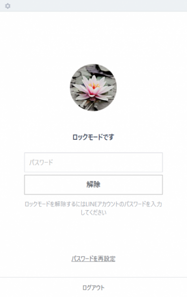
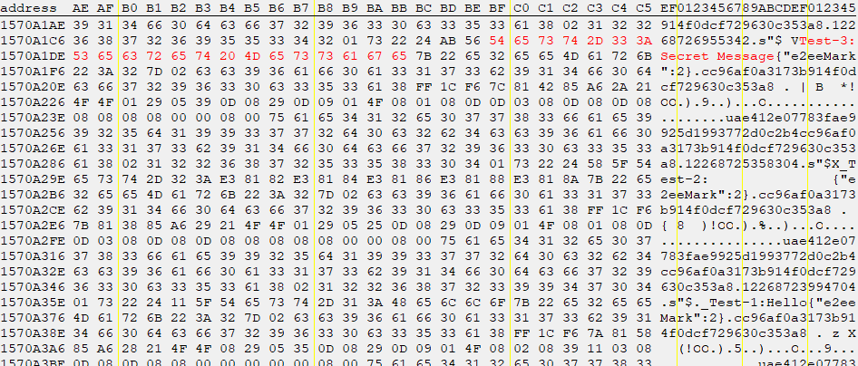

# PC版LINEをロックモードにしたまま席を立つなという話

## はじめに
PC版LINEには一時的に席を立つ場合や長時間操作されなかった場合にメッセージの送信や閲覧をロックできるロックモードがある。以下のような画面を見たことがあるだろう。  
  
実はこのロックモード、第三者が物理的に端末にアクセスできる場合にはメッセージを読み取ることができる。席を立つ際はWindows自体をロックするのをオススメする(モニタにパスワードが付箋で貼られて…)。  

## 方法
ロックモードのバイパスと聞いて難しい手法かと思われただろうが、メッセージがメモリ上に平文でのっかっているだけである。つまり、メモリのダンプができる権限があり、LINEがロックモードである端末にのみ攻撃を仕掛けることができる。浮気調査などに需要があるかもしれない(普通にキーロガーなど仕込んだ方が早い)。  

## 検証
Windows版で検証を行うことにする(Mac版は不明)。LINEをロックモードにし、別端末(Android)からトークを送信する。そのメッセージをロック越しに読み取ることを目的とする。今回はグループを作成して行ったが、他者からのトークでも同様の現象が発生する。  
  
メッセージ送信側(Android)  
  
  
メッセージ受信側(Windows)  
LINEのメモリを表示してみる。  
  
Test-2は日本語の関係で表示できていないが、すべてのメッセージが読み取れる。また、ダンプファイルから読み取ることもできる。タスクマネージャー -> プロセス -> LINEを右クリック -> ダンプファイルの作成(C) でダンプファイル(LINE.DMP)が得られる。これをwslでstrings(Testメッセージのみ)してみる。  
```bash
$ strings LINE.DMP | grep -o "\"text\":\"Test-.*\",\"location\":"
"text":"Test-3:Secret Message","location":
"text":"Test-1:Hello","location":
"text":"Test-3:Secret Message","location":
"text":"Test-3:Secret Message","location":
"text":"Test-3:Secret Message","location":
"text":"Test-3:Secret Message","location":
"text":"Test-3:Secret Message","location":
"text":"Test-1:Hello","location":
"text":"Test-3:Secret Message","location":
"text":"Test-3:Secret Message","location":
"text":"Test-3:Secret Message","location":
"text":"Test-3:Secret Message","location":
"text":"Test-3:Secret Message","location":
"text":"Test-3:Secret Message","location":
"text":"Test-3:Secret Message","location":
"text":"Test-1:Hello","location":
"text":"Test-3:Secret Message","location":
"text":"Test-1:Hello","location":
"text":"Test-3:Secret Message","location":
"text":"Test-3:Secret Message","location":
"text":"Test-3:Secret Message","location":
```
Test-2は日本語の関係でgrepできていないが、Test-1やTest-3が取得できている。`grep -o "\"text\":\".*\",\"location\":"`とすると他の(Testメッセージでない)メッセージも取得できる。  

## 結果
ロックモードでは以下のメッセージが読み取れた。  

- ロック中に受信したメッセージ  
- 各トークの最新メッセージ  
- ロック前に開いたことのあるトークのメッセージ  
- ロック中に他端末で送信したメッセージ  

これらのメッセージはログアウト後にもメモリ上に残っている。ログアウト後のダンプファイルをwslでstringsしてみる。  
```bash
$ strings LINE.DMP | grep -o "\"text\":\"Test-.*\",\"location\":"
"text":"Test-1:Hello","location":
"text":"Test-3:Secret Message","location":
"text":"Test-3:Secret Message","location":
```

## おわりに
LINEのロックモードは送信をロックするのみで、メッセージの閲覧は全くロックされていないことに注意しなければならない。物理的なアクセスによるため、危険性は低いとの見方もできるが"ロックしておけば安心！"とはならない。メッセージはログアウト後も残っているのでWindows自体のロックなしで席を立つときはLINEを一度終了した方がよい。  