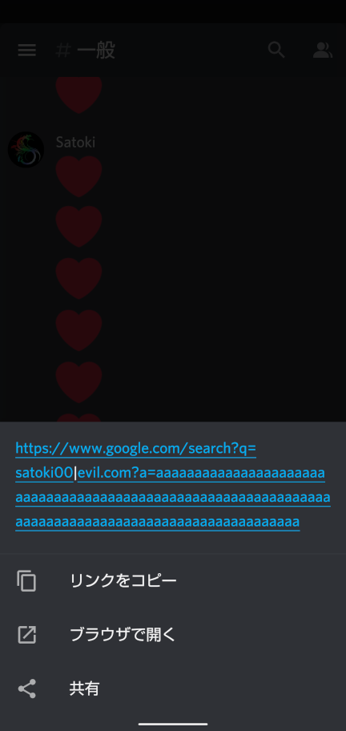
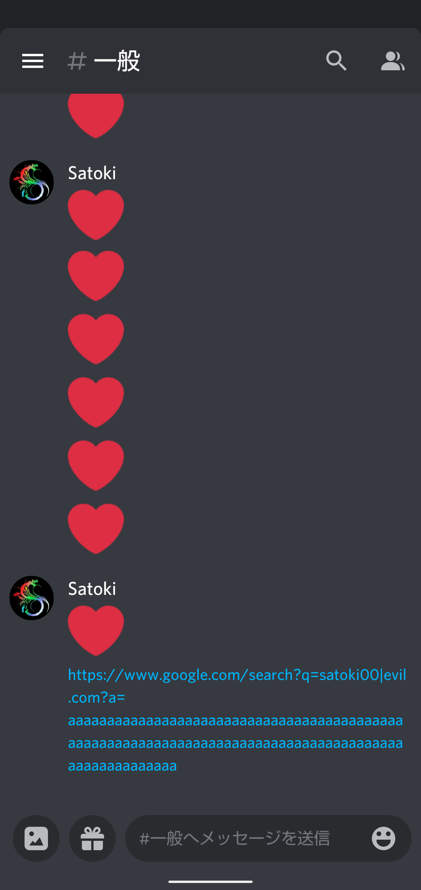
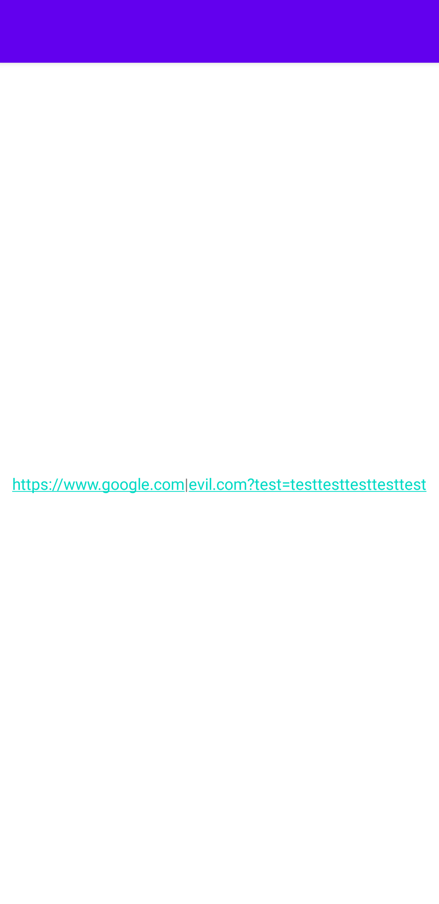
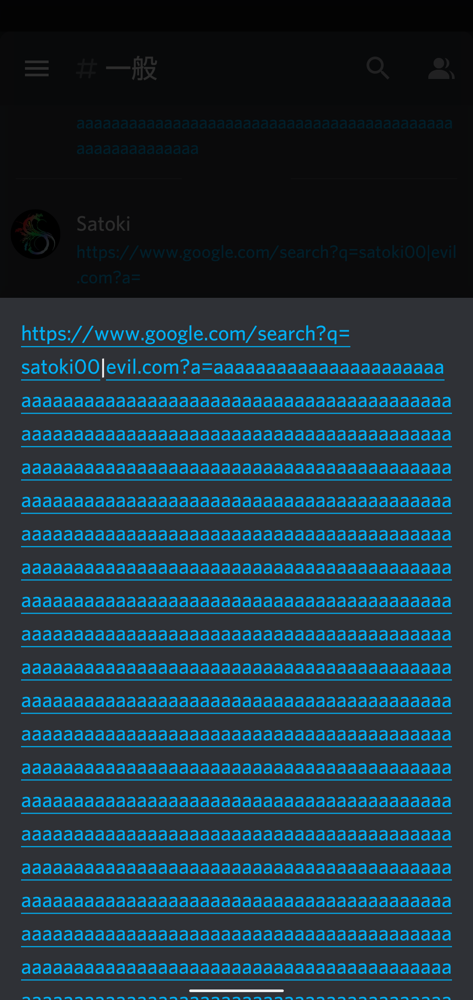
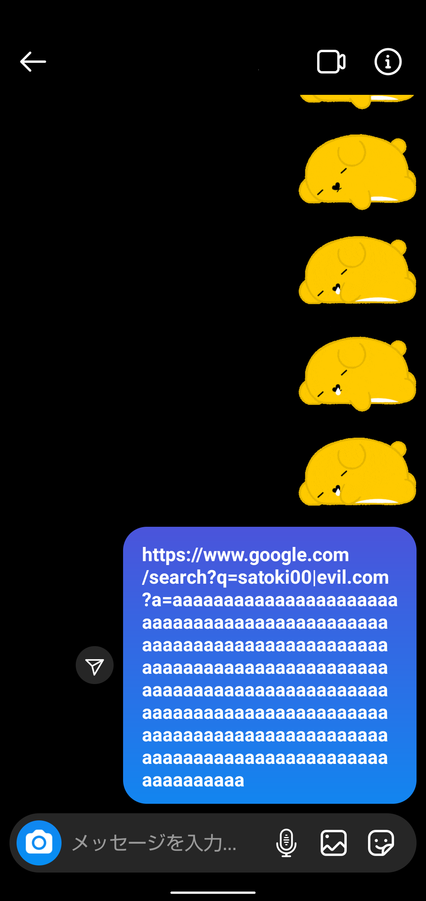
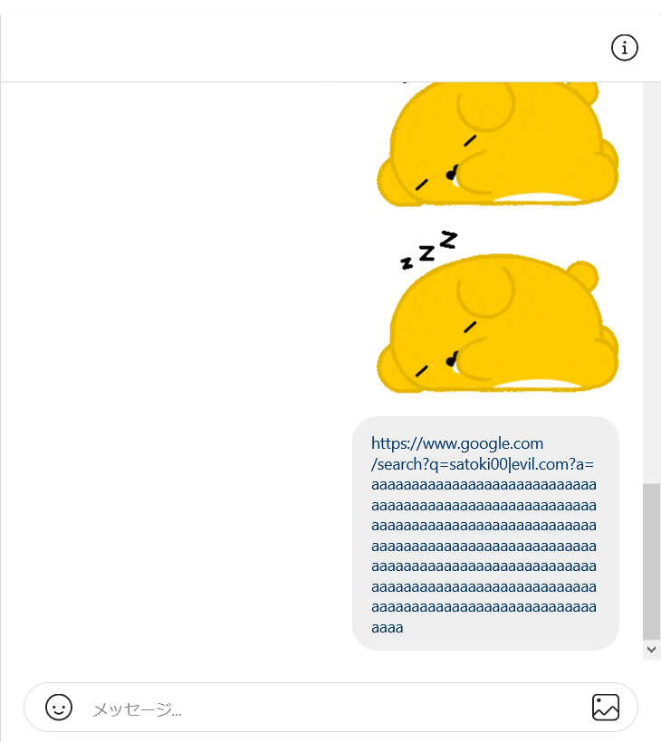
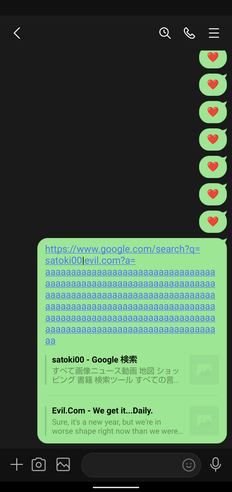
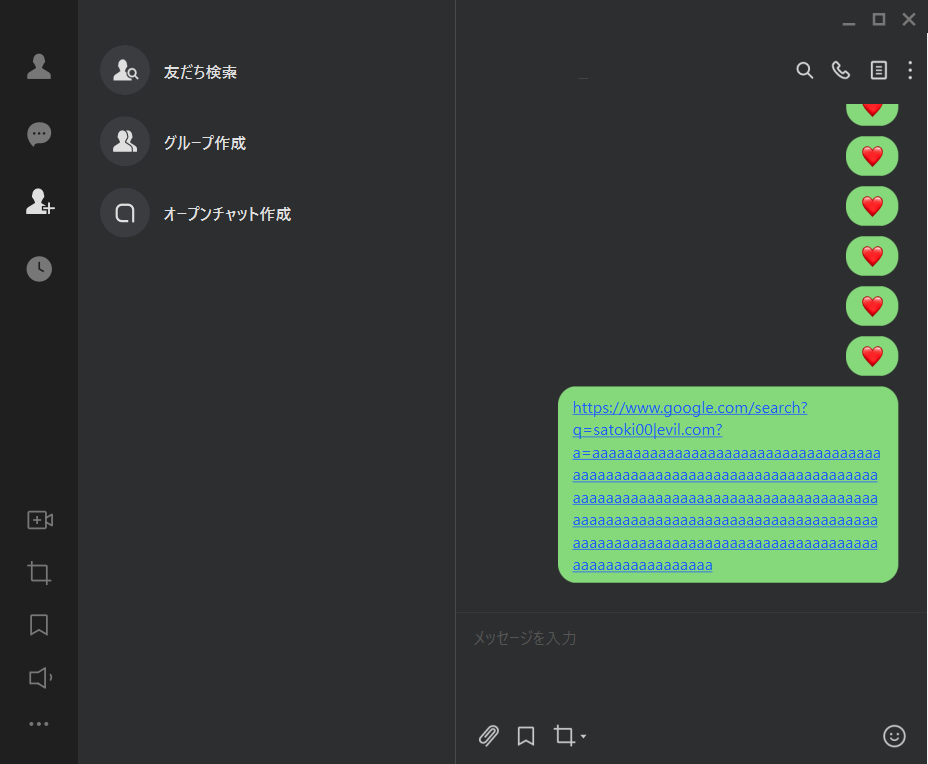
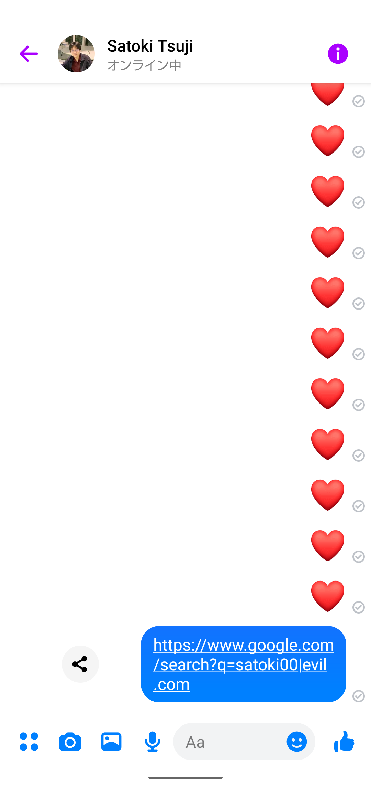
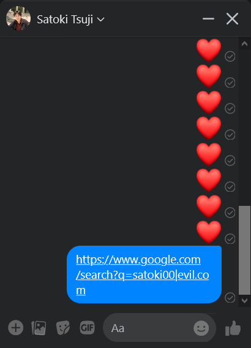

# URL未定義文字によるAndroidアプリへの悪性リンク挿入の話

## はじめに
本記事ではAndroidアプリについて知識がない状態で、脆弱性を探してやろうと挑んだ末に見つけた危険な挙動をまとめる。
脆弱性と言えないこともなく、おそらくBugBountyProgramなどを行っているアプリにも多く混入している実装であるため、報告は各自にお任せする(が私は焼き肉が食べたい)。  

**各開発元への確認を行った後に公開しています。記事の内容を験する場合、法律により処罰される可能性があります。**

## 不思議な挙動の発見
国際化ドメイン名によるスパムチェック回避の論文を読み、URL中の特殊文字の挙動について調査しようとDiscordアプリ(Androidクライアント)の自分専用チャンネルに特殊文字を含むリンクを投げていた。
すると自動リンク部分に以下のような挙動が見られた。  
  
ポップアップ中の`|`でリンクが切れているようだ。
URLに使用できる文字はRFC2396とRFC3986に定義されているらしく、`|`や`` ` ``はその中では定義されておらず使用不可能とされている。
これだけを見ると正常な挙動に思える。
しかし、ポップアップ外では一本のリンクになっている。  
  
念のためPCクライアントでも確認しようと開くと、以下のようであった。  
  
こちらもエンコードされて一本のリンクになっている。
こうして同じ投稿でも場所や環境によってリンクの解釈が異なるといった不思議な挙動を引き当てた。
以下のようなリンクで同様の現象が再現した。
```
https://www.google.com/search?q=satoki00|evil.com
https://www.google.com/search?q=satoki00`evil.com
https://www.google.com/search?q=satoki00０evil.com
https://www.google.com/search?q=satoki00愛evil.com
```

## URL自動リンク処理
アプリのURL自動リンク処理がどのように行われているか調査すると、Linkifyが利用されるようだ。  
Linkify  
[https://developer.android.com/reference/android/text/util/Linkify](https://developer.android.com/reference/android/text/util/Linkify)  
Linkifyを用いることでtext中の指定した部分をリンク化することができる。
指定方法によってはURLすべてをリンクにすることや、パターンマッチすることもできる。
試しにアプリを作成してみたところ、URLすべてをリンクする設定にすると`|`で分割が発生した。  
  
このことからもわかる通り、他のOSでは発生しない挙動だといえる。

## 危険性
環境によってリンクが分割されることで、意図せずフィッシングサイトなどに誘導される危険性がある。
以下のようにURLクエリパラメータを長くした場合、その部分をタップする確率が上がる。
```
https://www.google.com/search?q=satoki00%7Cevil.com?a=aaaaaaaaaaaaaaaaaaaaaaaaaaaaaaaaaaaaaaaaaaaaaaaaaaaaaaaaaaaaaaaaaaaaaaaaaaaaaaaaaaaaaaaaaaaaaaaaaaaaaaaaaaaaaaaaaaaaaaaaaaaaaaaaaaaaaaaaaaaaaaaaaaaaaaaaaaaaaaaaaaaaaaaaaaaaaaaaaaaaaaaaaaaaaaaaaaaaaaaaaaaaaaaaaaaaaaaaaaaaaaaaaaaaaaaaaaaaaaaaaaaaaaaaaaaaaaaaaaaaaaaaaaaaaaaaaaaaaaaaaaaaaaaaaaaaaaaaaaaaaaaaaaaaaaaaaaaaaaaaaaaaaaaaaaaaaaaaaaaaaaaaaaaaaaaaaaaaaaaaaaaaaaaaaaaaaaaaaaaaaaaaaaaaaaaaaaaaaaaaaaaaaaaaaaaaaaaaaaaaaaaaaaaaaaaaaaaaaaaaaaaaaaaaaaaaaaaaaaaaaaaaaaaaaaaaaaaaaaaaaaaaaaaaaaaaaaaaaaaaaaaaaaaaaaaaaaaaaaaaaaaaaaaaaaaaaaaaaaaaaaaaaaaaaaaaaaaaaaaaaaaaaaaaaaaaaaaaaaaaaaaaaaaaaaaaaaaaaaaaaaaaaaaaaaaaaaaaaaaaaaaaaaaaaaaaaaaaaaaaaaaaaaaaaaaaaaaaaaaaaaaaaaaaaaaaaaaaaaaaaaaaaaaaaaaaaaaaaaaaaaaaaaaaaaaaaaaaaaaaaaaaaaaaaaaaaaaaaaaaaaaaaaaaaaaaaaaaaaaaaaaaaaaaaaaaaaaaaaaaaaaaaaaaaaaaaaaaaaaaaaaaaaaaaaaaaaaaaaaaaaaaaaaaaaaaaaaaaaaaaaaaaaaaaaaaaaaaaaaaaaaaaaaaaaaaaaaaaaaaaaaaaaaaaaaaaaaaaaaaaaaaaaaaaaaaaaaaaaaaaaaaaaaaaaaaaaaaaaaaaaaaaaaaaaaaaaaaaaaaaaaaaaaaaaaaaaaaaaaaaaaaaaaaaaaaaaaaaaaa
```
  
Discordの場合はリンクの色が変化するため、注意深く確認すればリンクが分割されていることがわかるが、後述するアプリの中にはリンクの色が変化しないものもある。
この場合URLの分割をユーザが見分けることは難しい。
また、ユーザが該当するURLを他の端末で過去に開いたことがある場合、そのアドレスは信用できると認識してしまう。
ユーザから見るとPCなどでは正規のサイトに、Androidでは悪性サイトに飛ぶリンクとなる。

## 実際のアプリたち
この現象についてDiscord特有の問題であるか確認したところ、以下に挙げるようなアプリで同じものを確認できた。
リンクの色が変化しないものもあり、さらにユーザが見分けることが難しくなっている。

### Instagram
  
  

### LINE
  
  

### Messenger
  
  


## おわりに
ユーザの入力を信用し、そのまま自動リンク処理に渡すこと。


