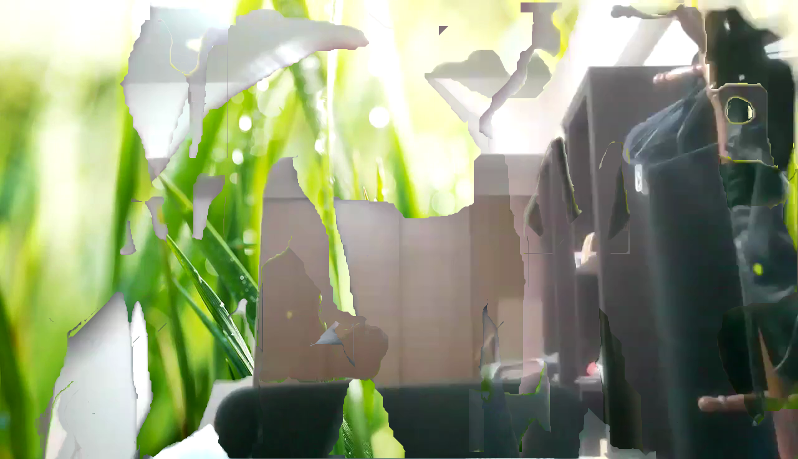

# 【手動】バーチャル背景が適用された動画から部屋の背景画像を復元する話

## はじめに
最近は物理的なウイルスの影響で、自宅でビデオ通話をする機会が増えています。
会議、飲み会、デートまで自宅で出来るので、家から出たくない族にとっては天国のような時間です。
しかし、「ヤバイ！部屋がオタクグッズまみれ！！」といった状況も少なくありません。
そんな時に使える神機能がバーチャル背景です。
キモい背景を、デートに耐えうる爽やかな背景へ変更してくれます。  
  
[@Zoom](https://zoom.us/)

## 部屋の背景のセキュリティとバーチャル背景
部屋の背景は私たちが思っているよりも多くの情報を提供しているかもしれません。
窓から電車が見える場合、線路の形状や電車の速度などから周辺駅はすぐに特定されます。
特徴的な看板や建造物などはピンポイントで場所を教えているのと同じです。
空が見える場合も危ないです。
飛行機の航路はリアルタイムでトラックできます。
壁であれば大丈夫。
ポスターでアイドルグループのファンであることがバレていませんか？
マンションなどは、全部屋の壁紙が一緒である場合もあります。
家具や食器は購入場所がわかる場合があります。
TVも地域によって放送内容が変わります。
以上の事からバーチャル背景を使用することは、自己防衛の一つといえるでしょう。

## 部屋の背景情報を取得する
前述した理由からバーチャル背景をセキュリティ向上を目的として使っている方も多いでしょう。
特に女性の方や、芸能活動をしている方には必須といえるかもしれません。
しかし、このバーチャル背景から部屋の背景が復元出来るとしたらどうでしょうか？
部屋の背景の復元など一見不可能に思えますが、唯一(部屋の)背景の情報が含まれている部分があります。
注目する部分は、以下の画像の赤丸です。
  
うまく切り抜けていないため境界面に背景の色情報が含まれています。
一枚だけでは何もわかりませんが、長時間の動画でかつ人物が動いている場合には背景の情報が蓄積されます。
境界が一ピクセルであっても、画面を横切った場合などは車のワイパーのごとく情報が取得される可能性があります。
まして、数ピクセルの境界線があった場合(髪の毛などでよく起こる)はさらに容易でしょう。
トイレに行くだけ、お茶をくみに行くだけで背景が復元される危険性があります。
動きが速いとバーチャル背景が追いつけないこともあります。
振った手の指の隙間から背景が見えているケースなどです。
うかつにバイバイできません。

## 部屋の背景情報を実際に復元してみる
ここまでは背景が復元できる可能性の話でした。
実際に復元できるのでしょうか？
今回ターゲットとするのはZoomで、グリーンスクリーンなしのバーチャル背景です。
環境はFMVA53XWKS搭載のカメラ、OSはWindows10です。
実際に背景を復元してみたのが以下の画像です。
  
45秒ほどの動画を撮影し、手動で切り貼りしました(もっと細かい情報を集めればより鮮明になる)。
検証のため少し激しい動きや不自然な動きをしましたが、バーチャル背景オンの状態です。
途中カメラを動かしてしまったミスもありましたが、おおむね背景を復元できたといってもよいでしょう。  
※カメラの画質も影響します。  
※部屋の色が統一されている場合、その色を選択することでバーチャル背景の精度を向上できます。

## おわりに
こうしてバーチャル背景から部屋の背景を復元することに成功しました。
この記事は技術的な興味と、誰もセキュリティ面でバーチャル背景に触れていない事から生み出されたので、使えるかは不明です。
CTFのフラグを背景に隠しておいて、それを読み取らせる問題とか作成できそうです。
とにかくバーチャル背景で安心せず、部屋を片付けてくれるオタクたちが増えることを望みます。
ネット上の美少女はだいたいハッカーなので部屋がバレていますよ。  
ちなみに、自動化してくれる方の出現を待っています。