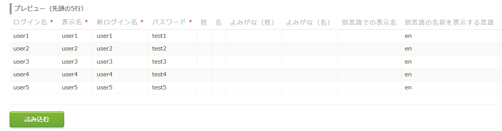
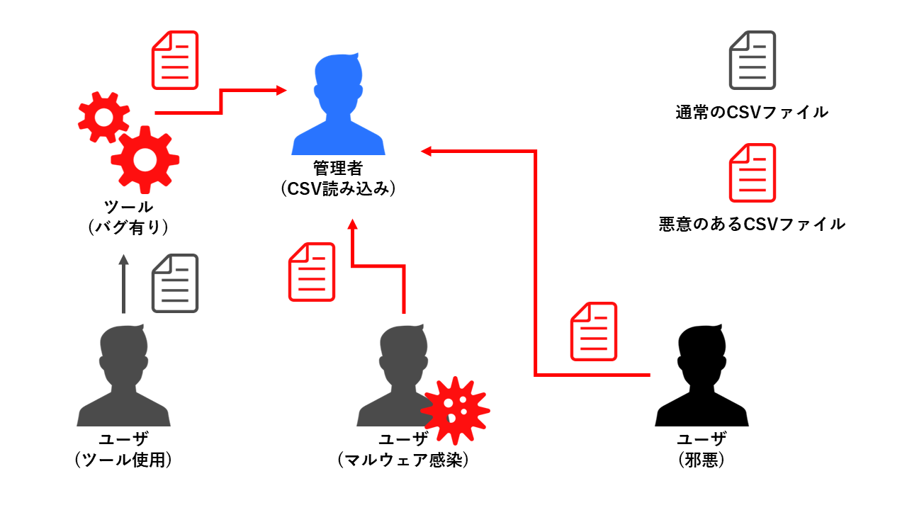

# サイボウズに認定されなかった脆弱性？の話

## はじめに
サイボウズ株式会社(サイボウズ)ではパッケージ製品やクラウドサービスの脆弱性を発見すると、報奨金を貰うことができる制度「サイボウズ脆弱性報奨金制度」がある。日本の企業でこのような制度を行っているところは少なく、HackerOneなど英語ベースのサイトに比べて日本人が利用しやすい。本記事ではサイボウズに脆弱性として認定されなかったものの、ユーザへのリスクとなり得る報告を置いておく。内容はサイボウズが仕様動作と判断したものであるため、ユーザ側での対策が必要となる。  
[サイボウズ脆弱性報奨金制度](https://cybozu.co.jp/products/bug-bounty/)  

**本記事の内容を験する場合、法律により処罰される可能性があります。本記事はサイボウズより公開許可を受けています。**  

## 脆弱性とは
[サイボウズ脆弱性情報ハンドリングポリシー](https://cybozu.co.jp/company/security-policy/)より  
>コンピュータのオペレーティングシステム(OS)、各種ソフトウェア、オンラインサービスにおける悪用可能な弱点 (ISO/IEC 29147 より引用)  

## 脆弱性概要(CSVファイルの読み込みによる管理者権限の奪取)
対象サービス：`cybozu.com 共通管理`  
被害想定：`Administratorのパスワード強制変更`、`Administratorの強制有効化`、`(管理者権限の奪取)`  
対策：CSVファイルにAdministratorの記述がない事を確認する  

cybozu.com 共通管理にはCSVファイルを読み込む(書き出す)ことにより、周辺サービス(Garoon、サイボウズOffice、kintone、メールワイズ)のユーザ情報を一括で登録、編集する機能がある。使用例としては、CSVを書き出した後に編集(新たなユーザを書き加える等)し、読み込ませる。これにより大量のユーザを手動で追加する必要がなくなる。ただし、管理者権限を持つユーザの追加はCSVファイルからでは行えない。本脆弱性はこの機能に存在する。  

### 手法(CSVファイルへAdministratorへの変更を記述する)
本来は前述したCSVファイルへAdministratorの記述がなされることは無い。というのもAdministratorはサービス開始時から設置されている管理者であり、デフォルトで無効化されている特別なユーザであるためだ。CSVファイルへのユーザ情報書き出しにおいても、他のユーザ情報は書き出されるのに対し、Administratorは書き出されない。つまりAdministratorの情報を変更するためには、別の設定画面から行う必要がある。しかし、CSVファイルに以下のような記述を行う事で、Administratorのパスワードを変更できる。  

```text:XXXXX.csv
user1,user1,user1,test1,,,,,,en,,1,,Asia/Tokyo,,,,,,,,,,,
user2,user2,user2,test2,,,,,,en,,1,,Asia/Tokyo,,,,,,,,,,,
user3,user3,user3,test3,,,,,,en,,1,,Asia/Tokyo,,,,,,,,,,,
user4,user4,user4,test4,,,,,,en,,1,,Asia/Tokyo,,,,,,,,,,,
user5,user5,user5,test5,,,,,,en,,1,,Asia/Tokyo,,,,,,,,,,,
Administrator,Administrator,Administrator,password,,,,,,en,,1,,Asia/Tokyo,,,,,,,,,,,
```

CSVファイルの読み込み画面は以下のようになっている。  
  

先頭5行のみしか閲覧できないため、Administratorの表示が無い事が分かる。現段階では6行目に存在するためCSVファイルを開くことで確認できるが、これが数百、数千行となると確認は不可能である。Administratorでのログイン中にも、本脆弱性は機能する。さらに恐ろしいことに、デフォルトで無効化されているAdministratorが有効化されている。  

### 攻撃シナリオ(CSVファイルの受け渡し、CSVファイルの改竄)
攻撃シナリオイメージ  
  
外部から送信されてきたCSVファイルを読み込む可能性は無いだろう。しかし、膨大なユーザ管理を一個人で行う組織は少なく、(同組織の)他者からの変更、追加データを受け渡す運用が考えられる。この際、悪意を持った者がAdministratorへの記述をCSVファイルへ書き加えた場合、管理者権限を奪取することが可能となり、全ての登録情報やメール内容などを取得できる。CSVファイルを読み込むユーザがチェックを行うことで攻撃を防止することが可能だが、ユーザ登録のためのCSVファイルを読み込む事で管理者権限が奪取されると認識している人間はいないと思われる。CSVファイルをツール等により自動生成する場合、そのツールのバグなどによって本脆弱性が使用される危険性が存在する。さらにユーザ管理を一個人で行う場合、CSVファイルを読み込むユーザがチェックを行う場合、同僚には聖人しかいない場合のいずれでも、マルウェア感染における攻撃は成立し得る。CSVファイルの渡し元がマルウェアに感染している場合、意図せずAdministratorへの記述が混入する。攻撃者視点では本件CSVファイルを検索し、Administratorへの記述を注入するだけで多くの情報を収集できる理想的な脆弱性だと言える。  

### 脆弱性であると判断した理由
以下の理由により脆弱性であるとの判断を行った。  

- 利用者がユーザ登録のためのCSVファイル読み込みで、Administratorに変更が加わる可能性を認識していないこと。  
- Administratorの無効化が解除され、強制的に有効化されること。  
- 他者提供のCSVファイル、複数人で管理されるCSVファイルを扱う可能性があること。  
- CSVファイルの内容について、先頭5行以降が確認不可能であること。  
- ユーザについての情報収集を必要としないため、無差別な攻撃が可能であること。  
- Administratorでのログイン中にも、情報に変更が加わること。  
- 管理者の設定やグループの変更から管理者権限を付加する操作に比べ、操作コストが低いこと。  
- 機密性への影響を及ぼすこと。  
    - 個人情報の閲覧  
    - スケジュールの閲覧  
    - メールの閲覧  
- 完全性への影響を及ぼすこと。  
    - 個人情報の改竄  
    - ファイルの改竄  
    - ユーザアカウントの改竄  
    - メールの改竄  
    - 周辺サービスサイトの改竄  
- 可用性への影響を及ぼすこと。  
    - ユーザアカウント削除によるサービス停止  
    - ファイルの削除による業務停止  

## ユーザが行うべき対策
CSVファイルの情報を確認することにより本脆弱性のリスクを無くすことができる。ログイン名を初期設定であるAdministratorから変更することで無差別な攻撃を防止する事ができるが、攻撃者が管理者権限を持つユーザのログイン名を入手している場合、この対策は意味をなさない。また、以下のようなコマンドで簡易的にチェックが可能である。  
Linux  
`grep "Administrator" XXXXX.csv`  
Windows  
`find "Administrator" XXXXX.csv`  

## サイボウズの評価

【評価結果】  
　認定しない  
  
【評価詳細】  
　本件は仕様動作となります。  